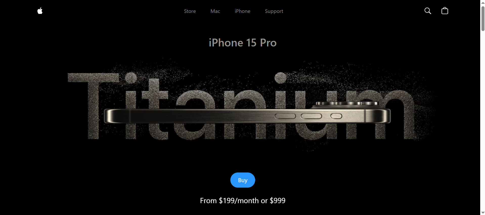
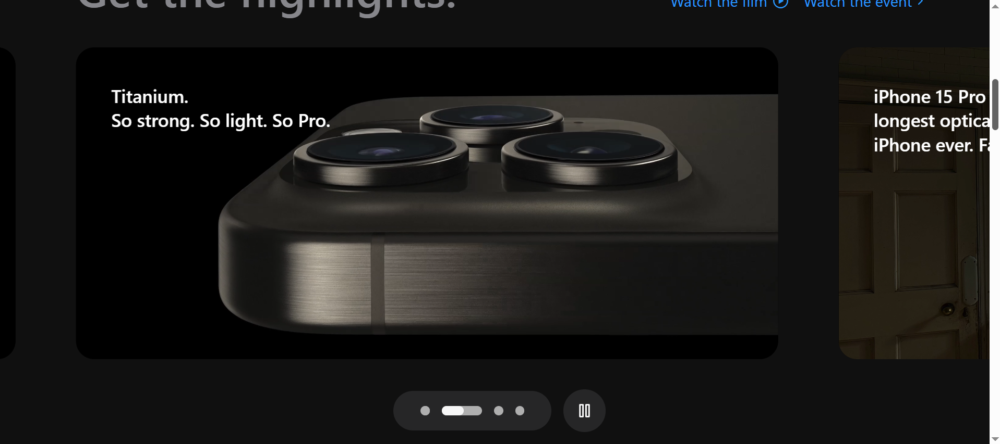
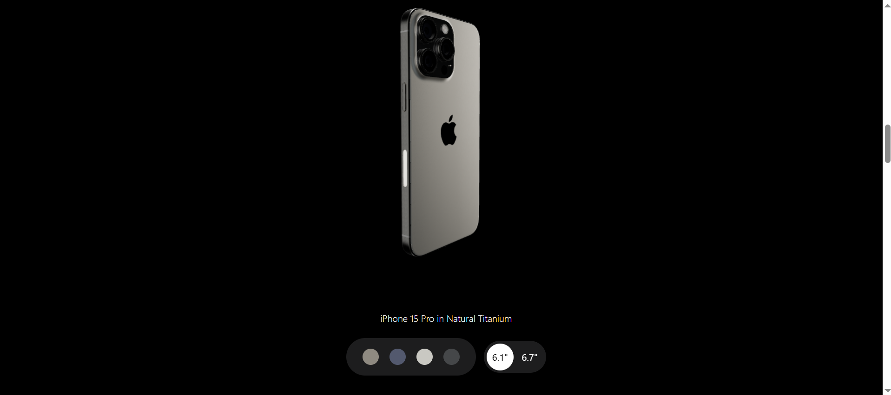

# IPhone-Website

A web-based interactive experience built using **React**, **Three.js**, and **GSAP animation**. This project showcases the use of modern web technologies to create visually appealing animations and 3D experiences in a browser environment.

## 📸 Screenshots

<p align="center">
 
  
  
</p>


## Overview

The **IPhone-Website** project is a learning endeavor aimed at exploring:

- **Three.js**: For rendering and animating 3D objects.
- **GSAP (GreenSock Animation Platform)**: For smooth, timeline-based animations and interactions.

## Features

- **3D Models**: Interactive and dynamic 3D representations using Three.js.
- **Custom Animations**: Engaging animations powered by GSAP.
- **Responsive Design**: Ensuring compatibility with different devices and screen sizes.

## Installation

To run the project locally:

1. Clone the repository:
   ```bash
   git clone https://github.com/your-username/IPhone-Website.git
   ```
   
2. Navigate to the project directory:
   ```bash
   cd IPhone-Website
   ```
   
3. Install dependencies:
   ```bash
   npm install
   ```
   
4. Start the development server:
   ```bash
   npm run dev
   ```

5. The application will be available at http://localhost:5173.
